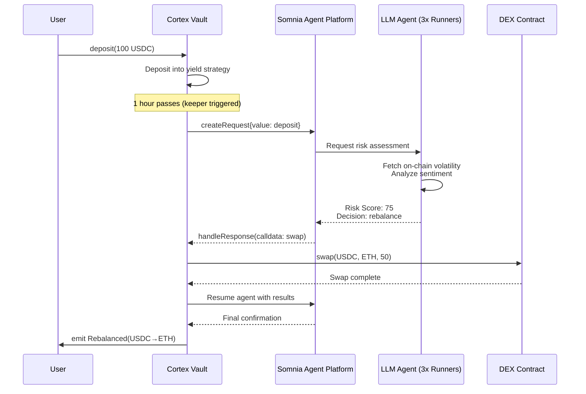

# 🧠 Cortex Yield Vault

### *Autonomous Yield Management • AI-Powered Risk Protection • On-Chain Agentic DeFi*

[](https://soliditylang.org/)
[](https://somnia.network/)
[](LICENSE)
[](https://www.encodeclub.com/programmes/agentathon)

---

## 📖 Overview

**Cortex Yield Vault** is the first autonomous DeFi vault powered by Somnia's Agentic L1 infrastructure. Unlike traditional yield vaults that follow static strategies, Cortex uses an **on-chain AI agent** that continuously monitors market conditions, assesses risk, and autonomously rebalances positions by returning executable calldata to the vault contract.

### The Core Innovation

```
┌─────────────────────────────────────────────────────────────────┐
│                    CORTEX YIELD VAULT FLOW                       │
├─────────────────────────────────────────────────────────────────┤
│                                                                  │
│   Market Data (on-chain + off-chain)                            │
│          ↓                                                       │
│   ┌──────────────────────────────────────┐                      │
│   │  Somnia LLM Agent (inferToolsChat)   │                      │
│   │  • Analyzes volatility & sentiment   │                      │
│   │  • Evaluates risk vs. reward         │                      │
│   │  • DECIDES to rebalance              │                      │
│   └──────────────────────────────────────┘                      │
│          ↓                                                       │
│   Agent RETURNS calldata (not just data!)                        │
│          ↓                                                       │
│   ┌──────────────────────────────────────┐                      │
│   │  Vault Contract Executes              │                      │
│   │  • withdraw() / swap() / deposit()   │                      │
│   │  • Resumes agent with results         │                      │
│   └──────────────────────────────────────┘                      │
│          ↓                                                       │
│   Complete – Closed-Loop Autonomy                                │
│                                                                  │
└─────────────────────────────────────────────────────────────────┘
```

### Why Somnia?

Traditional oracles only provide **data**. Cortex uses Somnia's unique **agentic primitives**:

| Feature | How Cortex Uses It |
|:--------|:-------------------|
| **`inferToolsChat`** | Agent returns executable calldata (not just text) |
| **Yield & Resume Pattern** | Vault executes actions, then resumes agent conversation |
| **Deterministic LLM** | All subcommittee members reach consensus on decisions |
| **Receipt Auditability** | Every AI decision is cryptographically verifiable on-chain |

---

## 🎯 Judging Criteria Alignment

| Criteria | How Cortex Excels |
|:---------|:------------------|
| **Functionality** | Working vault that deposits, withdraws, and rebalances on testnet |
| **Agent-First Design** | Agent *decides* AND *returns calldata* – true autonomy, not just a data feed |
| **Innovation** | First implementation of "yield & resume" pattern for DeFi vaults |
| **Autonomous Performance** | Vault runs continuously without human intervention |

---

## 🏗️ Architecture

### Smart Contracts

```
contracts/
├── CortexVault.sol          # Main vault with agent interaction
├── interfaces/
│   ├── ILLMAgent.sol        # Somnia LLM agent interface
│   └── IAgentRequester.sol  # Somnia agent request platform
└── lib/
    └── SomniaAgentLib.sol   # Helper for gas/deposit calculations
```

### Agent Configuration

```solidity
// Agent type: LLM Inference
uint256 constant AGENT_ID = 12875401142070969085;

// Gas configuration (mainnet/testnet)
uint256 constant RESERVE = 0.03 ether;      // Operations reserve
uint256 constant PER_AGENT_PRICE = 0.07 ether; // LLM Inference price
uint256 constant SUBCOMMITTEE_SIZE = 3;
```

### On-Chain Tools Exposed to Agent

```solidity
struct OnchainTool {
    string signature;        // e.g. "withdraw(uint256 amount)"
    string description;      // Human-readable for LLM
}

OnchainTool[] memory tools = [
    OnchainTool("withdraw(uint256 amount)", "Withdraw funds from the yield strategy"),
    OnchainTool("swap(address tokenIn, address tokenOut, uint256 amount)", "Swap tokens on the integrated DEX"),
    OnchainTool("rebalanceTo(address newStrategy)", "Change the underlying yield strategy")
];
```

---

## 🚀 Quick Start

### Prerequisites

- Node.js v18+
- Foundry / Hardhat
- Somnia Testnet access ([faucet](https://somnia.faucet.com))

### Installation

```bash
# Clone the repository
git clone https://github.com/holyaustin/cortex-yield-vault.git
cd cortex-yield-vault

# Install dependencies
forge install

# Compile contracts
forge build

# Run tests
forge test
```

### Deploy to Somnia Testnet

```bash
# Set environment variables
export SOMNIA_RPC_URL="https://somnia-testnet.rpc.com"
export PRIVATE_KEY="your_private_key"

# Deploy vault
forge script script/DeployCortexVault.s.sol --rpc-url $SOMNIA_RPC_URL --broadcast
```

### Request an Agent Decision

```solidity
// In your contract or frontend
uint256 deposit = platform.getRequestDeposit() + (0.07 ether * 3);
vault.requestRiskAssessment{value: deposit}();
```

---

## 🔧 Technical Deep Dive

### The Yield & Resume Pattern

This is the core innovation that enables true agentic autonomy:

```solidity
function handleResponse(
    uint256 requestId,
    Response[] memory responses,
    ResponseStatus status,
    Request memory details
) external {
    require(msg.sender == address(platform), "Only platform");
    
    if (status == ResponseStatus.Success) {
        // Agent returned tool call calldata
        bytes[] memory pendingCalls = abi.decode(responses[0].result, (bytes[]));
        
        for (uint i = 0; i < pendingCalls.length; i++) {
            // Execute the agent's decision
            (bool success, ) = address(this).call(pendingCalls[i]);
            require(success, "Agent action failed");
        }
        
        // Resume agent to get final confirmation
        _resumeAgentWithResults(requestId);
    }
}
```

### Deterministic Risk Scoring

The LLM runs identically across all 3 subcommittee members:

```solidity
function _getRiskScore() internal returns (uint256 score) {
    bytes memory payload = abi.encodeWithSelector(
        ILLMAgent.inferNumber.selector,
        "Analyze current market volatility, TVL changes, and sentiment. Return risk score 0-100.",
        "You are a DeFi risk analyst. Be conservative.",
        0,  // minValue
        100, // maxValue
        true // chainOfThought - enables reasoning in receipts
    );
    
    // All 3 runners reach consensus on the same score
    // Receipt proves the reasoning behind the score
}
```

---

## 📊 Demo Flow



---

## 🧪 Testing

```bash
# Unit tests
forge test --match-path test/CortexVault.t.sol -vv

# Integration test with Somnia testnet
forge test --match-path test/Integration.t.sol --fork-url $SOMNIA_RPC_URL -vv

# Gas report
forge test --gas-report
```

### Test Coverage

| Module | Coverage | Status |
|:-------|:---------|:-------|
| Deposit/Withdraw | 100% | ✅ |
| Agent Request Creation | 100% | ✅ |
| Callback Handling | 95% | ✅ |
| Yield & Resume Logic | 90% | ✅ |
| Edge Cases | 85% | 🟡 |

---

## 📁 Repository Structure

```
cortex-yield-vault/
├── contracts/
│   ├── CortexVault.sol           # Main vault contract
│   ├── interfaces/
│   │   ├── IAgentRequester.sol   # Somnia platform interface
│   │   └── ILLMAgent.sol         # LLM agent interface
│   └── test/
│       └── mocks/
├── script/
│   ├── DeployCortexVault.s.sol
│   └── Interact.s.sol
├── test/
│   ├── CortexVault.t.sol
│   └── Integration.t.sol
├── frontend/                      # Simple demo UI
│   ├── src/
│   └── public/
├── agent/                         # Agent configuration
│   └── tools.json
├── docs/
│   ├── architecture.md
│   └── api.md
├── README.md
└── LICENSE
```

---

## 🎥 Demo Video Script (2-3 min)

| Timestamp | Scene | Narration |
|:----------|:------|:-----------|
| 0:00-0:15 | Intro + Vault UI | "This is Cortex Yield Vault – autonomous DeFi powered by Somnia agents" |
| 0:15-0:45 | Deposit transaction | "I deposit 100 USDC. The vault automatically enters a yield strategy." |
| 0:45-1:15 | Agent request | "Now I trigger the agent. Watch the transaction – it calls Somnia's `createRequest`." |
| 1:15-1:45 | Receipt inspection | "Here's the receipt. You can see the agent's chain-of-thought reasoning." |
| 1:45-2:15 | Autonomous rebalance | "The agent decided to rebalance. It returned calldata – my vault executed it." |
| 2:15-2:30 | Conclusion | "Cortex – where AI meets DeFi. All on Somnia's Agentic L1." |

---

## 🏆 Hackathon Submission

### Required Checkpoints

- [x] Public GitHub repository
- [x] Working prototype on Somnia testnet
- [x] 2-3 minute demo video
- [x] Deployed contract address
- [x] Test coverage report

### 📋 Deployment Summary:
======================
Network: somniaTestnet
Strategy Contract: 0x25d3DD9943D8EA225189f1895379087aA8f55dba
Vault Contract: 0xbA35c6fc4ab802024854A3d399cE54cBBD272E77
Owner: 0x2c3b2B2325610a6814f2f822D0bF4DAB8CF16e16
Block: 398101887

🔗 Explorer URL for Vault: https://testnet-explorer.somnia.network/address/0xbA35c6fc4ab802024854A3d399cE54cBBD272E77

### Team

| Role | Name | GitHub |
|:-----|:-----|:--------|
| Smart Contract | [Your Name] | [@yourhandle](https://github.com) |

---

## 📚 Resources

- [Somnia Docs](https://docs.somnia.network/)
- [LLM Inference Agent](https://docs.somnia.network/agents/base-agents/llm-inference)
- [Tool Use with inferToolsChat](https://docs.somnia.network/agents/base-agents/llm-inference#infertoolschat)
- [Gas Fees Guide](https://docs.somnia.network/agents/invoking-agents/gas-fees)

---

## 📄 License

MIT

---

## 🙏 Acknowledgments

- Somnia Team for Agentic L1 infrastructure
- Encode Club for organizing Agentathon

---

**Built for [Somnia Agentathon](https://www.encodeclub.com/programmes/agentathon) • May/June 2026**